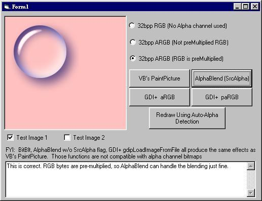



## FYI: 32bpp pARGB, ARGB Detection

### Description

Now that we are getting into the age of alphablending, PNGs, etc, wouldn't it be nice to offer ability to display 32bpp alpha bitmaps without having to know in advance if it indeed uses the alpha channel or whether or not the bitmap has its RGB bytes pre-multiplied? Try this out. It is a simple project wrapped around a routine that attempts to let you know those things a runtime. The project has some tips, shows a simple way to use AlphaBlend with non-premultiplied bitmaps and an pretty effective way to use GDI+ with 32bpp alpha bitmaps. Two test images are included in the RES file, but other than that, happing hunting for 32bpp alpha bitmaps, unless you care to create your own like I did for this test project.
 
### More Info
 

             |
---                |---
**Submitted On**   |2006-09-21 19:54:40
**By**             |[LaVolpe](https://github.com/Planet-Source-Code/PSCIndex/blob/master/ByAuthor/lavolpe.md)
**Level**          |Intermediate
**User Rating**    |5.0 (40 globes from 8 users)
**Compatibility**  |VB 6\.0
**Category**       |[Graphics](https://github.com/Planet-Source-Code/PSCIndex/blob/master/ByCategory/graphics__1-46.md)
**World**          |[Visual Basic](https://github.com/Planet-Source-Code/PSCIndex/blob/master/ByWorld/visual-basic.md)
**Archive File**   |[FYI\_\_32bpp2021179212006\.zip](https://github.com/Planet-Source-Code/lavolpe-fyi-32bpp-pargb-argb-detection__1-66619/archive/master.zip)

